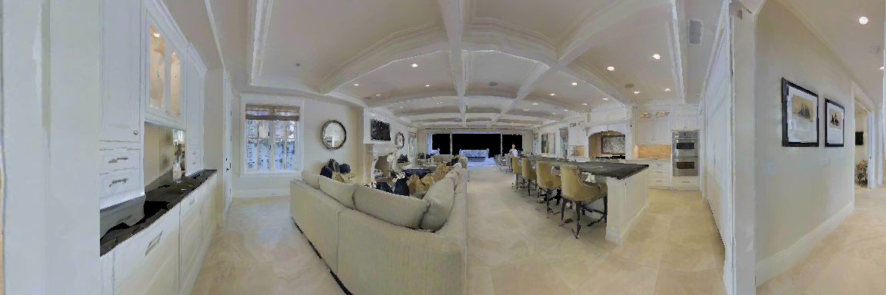
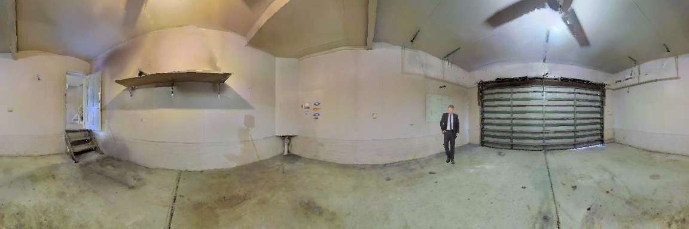
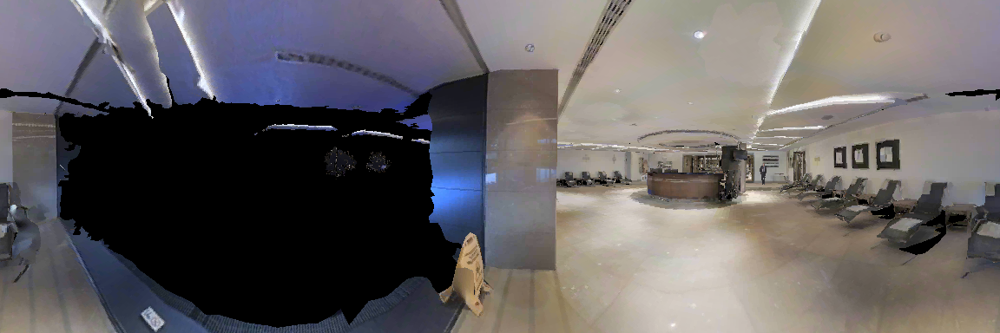
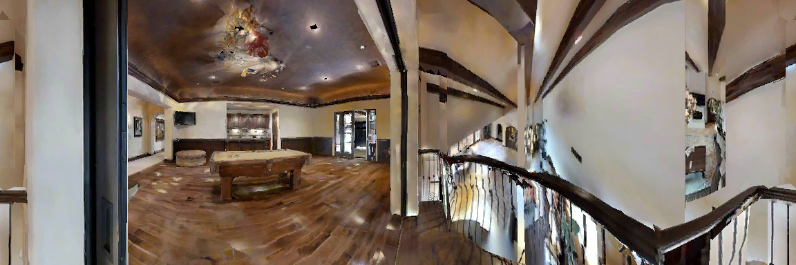
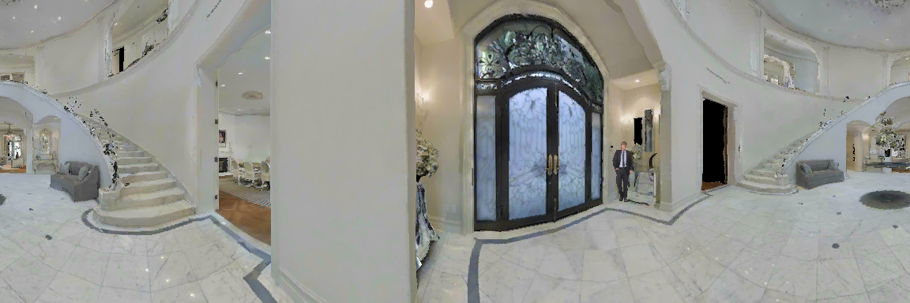
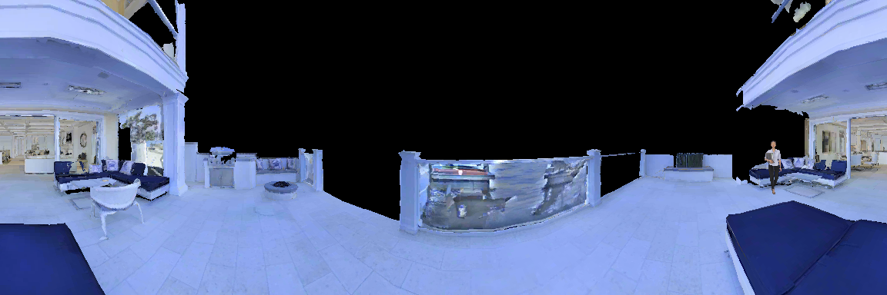

# MVSD: Mutual Learning for Acoustic Matching and Dereverberation via Visual Scene-driven Diffusion 
Audio style transfer under visual guidance has been made significant progress with the emergence of cross-modal generation. Nevertheless, simultaneously recording large-scale audio pairs at both the source and receiving ends presents a formidable challenge. What makes matters worse, existing methods treat each task independently, overlooking the inverse correlation between some dual tasks, which hinders the ability to leverage massive unlabeled data. In this paper, we introduce MVSD, a diffusion model-based mutual learning mechanism. MVSD exploits the intrinsic reciprocity between *visual acoustic matching (VAM)* and *dereverberation*, enabling learning from symmetric tasks and overcome the scarcity of data. More specifically, MVSD employs two converters: one for VAM called reverberator and another for dereverberation called dereverberator. The dereverberator judges whether the reverberation audio generated by reverberator sounds like being in the conditional visual scenario, and vice versa. By forming a closed loop, these two converters can generate informative feedback signals which can optimize the inverse tasks, even with easily acquired one-way unpaired data. Furthermore, we employ the diffusion model as foundational conditional generators to circumvent the training instability and over-smoothing drawbacks of conventional GAN architectures. Extensive experiments exhibit that our framework can improve the performance of each task and better match specified visual scenarios. In both tasks, MVSD surpasses competitors on two standard benchmarks. Remarkably, the performance of the models can be further enhanced by adding unpaired data.

# Visual Acoustic Matching (VAM)
## SoundSpaces
-----------------------------------------------------------------------------------------------------------------------------------------------------------------------------

<table style="width: 112%; margin-left: auto; margin-right: auto;">
    <tr>
    	<td> &nbsp;&nbsp;&nbsp;&nbsp;&nbsp;&nbsp;&nbsp;&nbsp;&nbsp;&nbsp;Source </td>
    	<td> &nbsp;&nbsp;&nbsp;&nbsp;&nbsp;&nbsp;&nbsp;&nbsp;&nbsp;&nbsp;&nbsp;&nbsp; GT </td>
	<td> &nbsp;&nbsp;&nbsp;Image2Reverb </td>
	<td> &nbsp;&nbsp;&nbsp;&nbsp;&nbsp;&nbsp;&nbsp;&nbsp;&nbsp;&nbsp;&nbsp;Avatir </td>
	<td> &nbsp;&nbsp;&nbsp;&nbsp;&nbsp;&nbsp;&nbsp;&nbsp;&nbsp;&nbsp; MVSD </td>
    </tr>
    <tr>
    	<td><audio src="./samples/ss_reverb/source_3729-6852-0033_0.0290.wav" controls style="width: 150px;"></audio> </td>
    	<td><audio src="./samples/ss_reverb/gt_3729-6852-0033_0.0290.wav" controls style="width: 150px;"></audio> </td>
    	<td><audio src="./samples/ss_reverb/image2reverb/img2reverb_reverb_source_3729-6852-0033_0.0290.wav" controls style="width: 150px;"></audio> </td>
	<td><audio src="./samples/ss_reverb/avatir/avitar_reverb_source_3729-6852-0033_0.0290.wav" controls style="width: 150px;"></audio> </td>
	<td><audio src="./samples/ss_reverb/3729-6852-0033_0.0290.wav" controls style="width: 150px;"></audio> </td>
    </tr>
</table>

-----------------------------------------------------------------------------------------------------------------------------------------------------------------------------

<table style="width: 112%; margin-left: auto; margin-right: auto;">
    <tr>
    	<td> &nbsp;&nbsp;&nbsp;&nbsp;&nbsp;&nbsp;&nbsp;&nbsp;&nbsp;&nbsp;Source </td>
    	<td> &nbsp;&nbsp;&nbsp;&nbsp;&nbsp;&nbsp;&nbsp;&nbsp;&nbsp;&nbsp;&nbsp;&nbsp; GT </td>
	<td> &nbsp;&nbsp;&nbsp;Image2Reverb </td>
	<td> &nbsp;&nbsp;&nbsp;&nbsp;&nbsp;&nbsp;&nbsp;&nbsp;&nbsp;&nbsp;&nbsp;Avatir </td>
	<td> &nbsp;&nbsp;&nbsp;&nbsp;&nbsp;&nbsp;&nbsp;&nbsp;&nbsp;&nbsp; MVSD </td>
    </tr>
    <tr>
    	<td><audio src="./samples/ss_reverb/source_5639-40744-0034_0.0092.wav" controls style="width: 150px;"></audio> </td>
    	<td><audio src="./samples/ss_reverb/gt_5639-40744-0034_0.0092.wav" controls style="width: 150px;"></audio> </td>
    	<td><audio src="./samples/ss_reverb/image2reverb/img2reverb_reverb_source_5639-40744-0034_0.0092.wav" controls style="width: 150px;"></audio> </td>
	<td><audio src="./samples/ss_reverb/avatir/avitar_reverb_source_5639-40744-0034_0.0092.wav" controls style="width: 150px;"></audio> </td>
	<td><audio src="./samples/ss_reverb/5639-40744-0034_0.0092.wav" controls style="width: 150px;"></audio> </td>
    </tr>
</table>

-----------------------------------------------------------------------------------------------------------------------------------------------------------------------------

<table style="width: 112%; margin-left: auto; margin-right: auto;">
    <tr>
    	<td> &nbsp;&nbsp;&nbsp;&nbsp;&nbsp;&nbsp;&nbsp;&nbsp;&nbsp;&nbsp;Source </td>
    	<td> &nbsp;&nbsp;&nbsp;&nbsp;&nbsp;&nbsp;&nbsp;&nbsp;&nbsp;&nbsp;&nbsp;&nbsp; GT </td>
	<td> &nbsp;&nbsp;&nbsp;Image2Reverb </td>
	<td> &nbsp;&nbsp;&nbsp;&nbsp;&nbsp;&nbsp;&nbsp;&nbsp;&nbsp;&nbsp;&nbsp;Avatir </td>
	<td> &nbsp;&nbsp;&nbsp;&nbsp;&nbsp;&nbsp;&nbsp;&nbsp;&nbsp;&nbsp; MVSD </td>
    </tr>
    <tr>
    	<td><audio src="./samples/ss_reverb/source_4077-13751-0007_0.0120.wav" controls style="width: 150px;"></audio> </td>
    	<td><audio src="./samples/ss_reverb/gt_4077-13751-0007_0.0120.wav" controls style="width: 150px;"></audio> </td>
    	<td><audio src="./samples/ss_reverb/image2reverb/img2reverb_reverb_source_4077-13751-0007_0.0120.wav" controls style="width: 150px;"></audio> </td>
	<td><audio src="./samples/ss_reverb/avatir/avitar_reverb_source_4077-13751-0007_0.0120.wav" controls style="width: 150px;"></audio> </td>
	<td><audio src="./samples/ss_reverb/4077-13751-0007_0.0120.wav" controls style="width: 150px;"></audio> </td>
    </tr>
</table>

-----------------------------------------------------------------------------------------------------------------------------------------------------------------------------

## AVSpeech

<table style="width: 112%; margin-left: auto; margin-right: auto;">
    <tr>
    	<td> &nbsp;&nbsp;&nbsp;&nbsp;&nbsp;&nbsp;&nbsp;&nbsp;&nbsp;&nbsp;Source </td>
    	<td> &nbsp;&nbsp;&nbsp;&nbsp;&nbsp;&nbsp;&nbsp;&nbsp;&nbsp;&nbsp;&nbsp;&nbsp; GT </td>
	<td> &nbsp;&nbsp;&nbsp;Image2Reverb </td>
	<td> &nbsp;&nbsp;&nbsp;&nbsp;&nbsp;&nbsp;&nbsp;&nbsp;&nbsp;&nbsp;&nbsp;Avatir </td>
	<td> &nbsp;&nbsp;&nbsp;&nbsp;&nbsp;&nbsp;&nbsp;&nbsp;&nbsp;&nbsp; MVSD </td>
    </tr>
    <tr>
    	<td><audio src="./samples/avs_reverb/source_101377_0.0050.wav" controls style="width: 150px;"></audio> </td>
    	<td><audio src="./samples/avs_reverb/gt_101377_0.0050.wav" controls style="width: 150px;"></audio> </td>
    	<td><audio src="./samples/avs_reverb/image2reverb/img2reverb_reverb_source_101377_0.0050.wav" controls style="width: 150px;"></audio> </td>
	<td><audio src="./samples/avs_reverb/avatir/avitar_reverb_source_101377_0.0050.wav" controls style="width: 150px;"></audio> </td>
	<td><audio src="./samples/avs_reverb/101377_0.0050.wav" controls style="width: 150px;"></audio> </td>
    </tr>
</table>

-----------------------------------------------------------------------------------------------------------------------------------------------------------------------------

<table style="width: 112%; margin-left: auto; margin-right: auto;">
    <tr>
    	<td> &nbsp;&nbsp;&nbsp;&nbsp;&nbsp;&nbsp;&nbsp;&nbsp;&nbsp;&nbsp;Source </td>
    	<td> &nbsp;&nbsp;&nbsp;&nbsp;&nbsp;&nbsp;&nbsp;&nbsp;&nbsp;&nbsp;&nbsp;&nbsp; GT </td>
	<td> &nbsp;&nbsp;&nbsp;Image2Reverb </td>
	<td> &nbsp;&nbsp;&nbsp;&nbsp;&nbsp;&nbsp;&nbsp;&nbsp;&nbsp;&nbsp;&nbsp;Avatir </td>
	<td> &nbsp;&nbsp;&nbsp;&nbsp;&nbsp;&nbsp;&nbsp;&nbsp;&nbsp;&nbsp; MVSD </td>
    </tr>
    <tr>
    	<td><audio src="./samples/avs_reverb/source_101627_0.0150.wav" controls style="width: 150px;"></audio> </td>
    	<td><audio src="./samples/avs_reverb/gt_101627_0.0150.wav" controls style="width: 150px;"></audio> </td>
    	<td><audio src="./samples/avs_reverb/image2reverb/img2reverb_reverb_source_101627_0.0150.wav" controls style="width: 150px;"></audio> </td>
	<td><audio src="./samples/avs_reverb/avatir/avitar_reverb_source_101627_0.0150.wav" controls style="width: 150px;"></audio> </td>
	<td><audio src="./samples/avs_reverb/101627_0.0150.wav" controls style="width: 150px;"></audio> </td>
    </tr>
</table>

# Dereverbation

-----------------------------------------------------------------------------------------------------------------------------------------------------------------------------

<table style="width: 112%; margin-left: auto; margin-right: auto;">
    <tr>
    	<td> &nbsp;&nbsp;&nbsp;&nbsp;&nbsp;&nbsp;&nbsp;&nbsp;&nbsp;&nbsp;Source </td>
    	<td> &nbsp;&nbsp;&nbsp;&nbsp;&nbsp;&nbsp;&nbsp;&nbsp;&nbsp;&nbsp;&nbsp;&nbsp; GT </td>
	<td> &nbsp;&nbsp;&nbsp;MetricGAN </td>
	<td> &nbsp;&nbsp;&nbsp;&nbsp;&nbsp;&nbsp;&nbsp;&nbsp;&nbsp;&nbsp;&nbsp;VIDA </td>
	<td> &nbsp;&nbsp;&nbsp;&nbsp;&nbsp;&nbsp;&nbsp;&nbsp;&nbsp;&nbsp; MVSD </td>
    </tr>
    <tr>
    	<td><audio src="./samples/ss_dereverb/source_2094-142345-0013_0.0203.wav" controls style="width: 150px;"></audio> </td>
    	<td><audio src="./samples/ss_dereverb/gt_2094-142345-0013_0.0203.wav" controls style="width: 150px;"></audio> </td>
    	<td><audio src="./samples/ss_dereverb/metricgan/metric_source_2094-142345-0013_0.0203.wav" controls style="width: 150px;"></audio> </td>
	<td><audio src="./samples/ss_dereverb/vida_dereverb/vida_source_2094-142345-0013_0.0203.wav" controls style="width: 150px;"></audio> </td>
	<td><audio src="./samples/ss_dereverb/2094-142345-0013_0.0203.wav" controls style="width: 150px;"></audio> </td>
    </tr>
</table>

-----------------------------------------------------------------------------------------------------------------------------------------------------------------------------

<table style="width: 112%; margin-left: auto; margin-right: auto;">
    <tr>
    	<td> &nbsp;&nbsp;&nbsp;&nbsp;&nbsp;&nbsp;&nbsp;&nbsp;&nbsp;&nbsp;Source </td>
    	<td> &nbsp;&nbsp;&nbsp;&nbsp;&nbsp;&nbsp;&nbsp;&nbsp;&nbsp;&nbsp;&nbsp;&nbsp; GT </td>
	<td> &nbsp;&nbsp;&nbsp;MetricGAN </td>
	<td> &nbsp;&nbsp;&nbsp;&nbsp;&nbsp;&nbsp;&nbsp;&nbsp;&nbsp;&nbsp;&nbsp;VIDA </td>
	<td> &nbsp;&nbsp;&nbsp;&nbsp;&nbsp;&nbsp;&nbsp;&nbsp;&nbsp;&nbsp; MVSD </td>
    </tr>
    <tr>
    	<td><audio src="./samples/ss_dereverb/source_7021-79730-0006_0.0181.wav" controls style="width: 150px;"></audio> </td>
    	<td><audio src="./samples/ss_dereverb/gt_7021-79730-0006_0.0181.wav" controls style="width: 150px;"></audio> </td>
    	<td><audio src="./samples/ss_dereverb/metricgan/metric_source_7021-79730-0006_0.0181.wav" controls style="width: 150px;"></audio> </td>
	<td><audio src="./samples/ss_dereverb/vida_dereverb/vida_source_7021-79730-0006_0.0181.wav" controls style="width: 150px;"></audio> </td>
	<td><audio src="./samples/ss_dereverb/7021-79730-0006_0.0088.wav" controls style="width: 150px;"></audio> </td>
    </tr>
</table>

-----------------------------------------------------------------------------------------------------------------------------------------------------------------------------

<table style="width: 112%; margin-left: auto; margin-right: auto;">
    <tr>
    	<td> &nbsp;&nbsp;&nbsp;&nbsp;&nbsp;&nbsp;&nbsp;&nbsp;&nbsp;&nbsp;Source </td>
    	<td> &nbsp;&nbsp;&nbsp;&nbsp;&nbsp;&nbsp;&nbsp;&nbsp;&nbsp;&nbsp;&nbsp;&nbsp; GT </td>
	<td> &nbsp;&nbsp;&nbsp;MetricGAN </td>
	<td> &nbsp;&nbsp;&nbsp;&nbsp;&nbsp;&nbsp;&nbsp;&nbsp;&nbsp;&nbsp;&nbsp;VIDA </td>
	<td> &nbsp;&nbsp;&nbsp;&nbsp;&nbsp;&nbsp;&nbsp;&nbsp;&nbsp;&nbsp; MVSD </td>
    </tr>
    <tr>
    	<td><audio src="./samples/ss_dereverb/source_1221-135766-0003_0.0018.wav" controls style="width: 150px;"></audio> </td>
    	<td><audio src="./samples/ss_dereverb/gt_1221-135766-0003_0.0018.wav" controls style="width: 150px;"></audio> </td>
    	<td><audio src="./samples/ss_dereverb/metricgan/metric_source_1221-135766-0003_0.0018.wav" controls style="width: 150px;"></audio> </td>
	<td><audio src="./samples/ss_dereverb/vida_dereverb/vida_source_1221-135766-0003_0.0018.wav" controls style="width: 150px;"></audio> </td>
	<td><audio src="./samples/ss_dereverb/1221-135766-0003_0.0082.wav" controls style="width: 150px;"></audio> </td>
    </tr>
</table>
